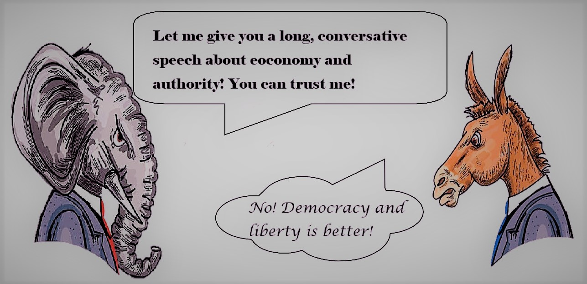

# Spring 2018
# Project 1: What did the presidents say at their inauguation?


### [Project Description](doc/Proj1_desc.md)

Term: Spring 2018

+ Projec title: Donkey vs. Elephant: What's Their True Face?
+ This project is conducted by Hongyu Li (hl3099). 

+ Project summary: Here I conduct a brief study on the differences of inauguration speeches between the Democratic Party and the Republican Party. Basically, this study used some techniques of text mining, analyzing some basic characteristics, keywords and sentiments of the speeches from these two parties. The results showed that the Republican Party delivers a long, consersative speech which talks about economy and authority with trustful words while the Democratic Party delivers a short, open speech which talks about democracy and liberty with positive words.




### [Project Report](doc/proj1_report.html)

### [Project Code](doc/proj1_report.Rmd)

Following [suggestions](http://nicercode.github.io/blog/2013-04-05-projects/) by [RICH FITZJOHN](http://nicercode.github.io/about/#Team) (@richfitz). This folder is orgarnized as follows.

```
proj/
|-- R/
|-- data/
|-- doc/
|-- figs/
|-- output/
|-- analysis.R
```

Please see each subfolder for a README file.
